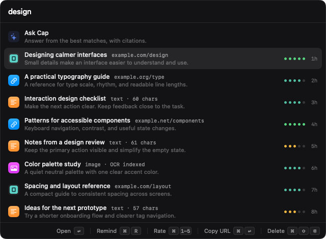
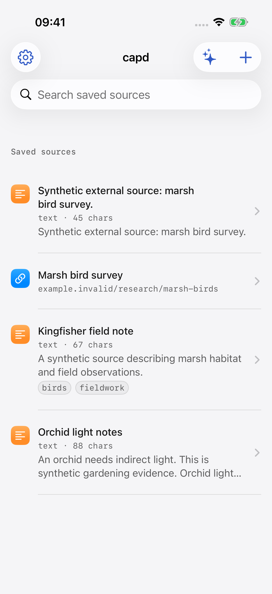
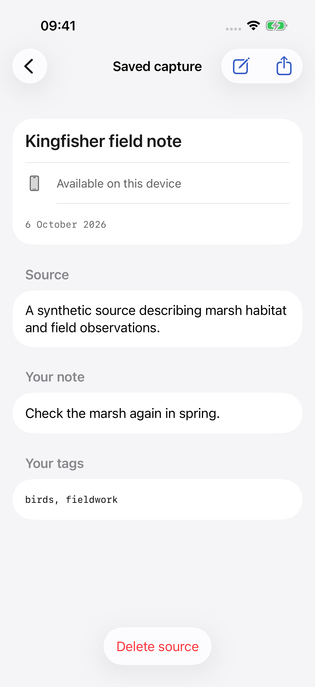
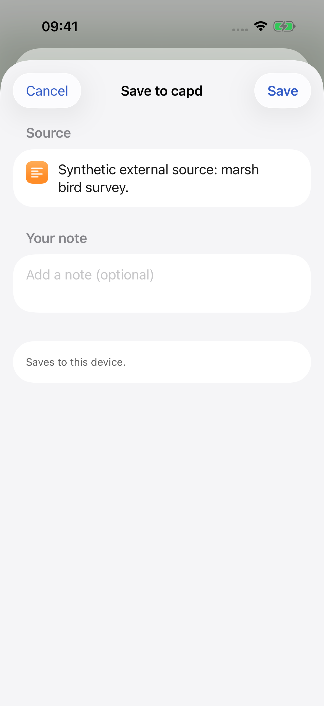

[](https://github.com/EzraCerpac/capd)

# Capd — a local library for Mac and iPhone

Capture useful links, selected text, notes and images on your Mac, then find them
with full-text search. This fork adds an iPhone/iPad client and optional device
sync through a library server you configure. Each device keeps a local library,
so saving and reading do not depend on a live connection.

This is **[EzraCerpac/capd](https://github.com/EzraCerpac/capd)**, a fork of
**[Jamie Davenport’s Capd](https://github.com/jamiedavenport/capd)**. Jamie’s
native Mac app is the foundation. The upstream website, Homebrew cask and
release channel describe upstream Capd; they do not install this fork’s added
features.

[Install this fork](docs/content/01-install.mdx) ·
[Connect devices](docs/content/08-sync.mdx) ·
[Troubleshooting](docs/content/09-troubleshooting.mdx) ·
[Build and contribute](CONTRIBUTING.md)

## What you can do

| | Mac | iPhone and iPad |
| --- | --- | --- |
| Capture | Browser pages, selected text, links, clipboard images, dropped files, share sheet and CLI | Links and text in the app or incoming share sheet |
| Find | Full-text search, filters, Raycast and optional Spotlight/Shortcuts | Local search and optional Spotlight/Shortcuts |
| Annotate | Notes, tags, ratings and reminders | Notes, manual tags, conflict review and deletion |
| Process | Readable page content, image OCR and on-device automatic tagging | Display synchronized content; no mobile page fetching or OCR |
| Ask Cap | On-device answers with source citations | On-device answers when Apple’s model is available; no remote fallback |
| Website icons | Opt-in generation for eligible links saved on any connected device | Display verified icons received through sync |
| Sync | Enrolled HTTPS library connection and background Agent | Automatic sync while the app is active or reopened; share saves locally first |

The phone app does not promise delivery while iOS suspends it. A closed-app share
is available locally; opening Capd lets the app deliver queued work.

## Start with a local library

The Mac app requires **macOS 26 or later**. For a source build, use an Xcode
toolchain matching the fork’s build CI, currently **Xcode 26.4.1**. The iOS project
targets iOS 17 or later; Ask Cap separately requires iOS 26 or later and an
available Apple Intelligence model.

```sh
git clone https://github.com/EzraCerpac/capd.git
cd capd
./Scripts/bootstrap.sh
Scripts/package-app.sh
```

Packaging produces the Mac app and disk image in `dist/`. Local packages use an
ad hoc signature unless you supply a signing identity; packaging does not
notarize them. The iPhone app and library server are separate builds.

Read the [installation guide](docs/content/01-install.mdx) before replacing an
existing Capd installation: upstream and this fork share application identifiers,
the background helper and the default library location. A source build is not
automatically isolated from your existing data.

On the Mac, first-run onboarding introduces capture, search and optional macOS
permissions. Press `⌃⌥C` to capture and `⌥⇧Space` to search. The phone app has a
**+** capture button and a share extension.

## Connect your devices

Sync is optional. It uses an explicitly selected library, device identity and
credential, rather than a built-in account service.

The included server exposes a loopback HTTP endpoint; remote clients require an
HTTPS proxy and separately provisioned device grants. Hosting it on a NAS is a
deployment choice, not an automatic NAS installer or shared-folder sync. The
documented server build targets macOS; a Linux NAS deployment is not established
by that build.

On the phone, open **Device sync → Prepare device connection**. The connection
flow retains a backup and verifies the chosen service, library and device before
activation. An existing populated library needs the reviewed import workflow or
an explicit archive-only choice. The Mac’s `capd sync` commands activate, inspect,
pause and resume a prepared connection.

Follow [device setup and enrollment](docs/content/08-sync.mdx), including backup
and upgrade guidance. Keep the selected authority’s history and each device’s
queued work intact; a JSON content export is not a full sync-state backup.

## Recognize links at a glance

Enable **Settings → Network → Load website icons** on the Mac to generate icons.
Generation defaults off. The Mac Agent requests only an eligible saved HTTPS
host’s `/favicon.ico`, with no page path, query, cookies or credentials, and no
redirects.

Links saved on the phone acquire icons after their captures reach an opted-in,
awake Mac Agent. Icons then travel through the existing library server. Cached
icons remain available offline and when generation is disabled; the phone never
contacts saved websites for icons.

The phone’s **Show synced website icons** setting controls display. Missing or
unusable icons use a native symbol. See the [icon guide](docs/designs/website-icons.md)
for host, transport and compatibility limits.

## Recall and automate

Search the saved title, content, notes and OCR on the Mac, or narrow results:

```text
swift concurrency site:swift.org tag:development after:2026-01-01
```

Ask Cap answers from selected local sources with clickable citations. The phone
also displays supporting quotes. Availability depends on the device, OS, Apple
Intelligence settings, model readiness and locale. There is no remote model fallback, and citations
are evidence to inspect rather than a guarantee that an answer is correct.

Spotlight and Shortcuts are optional. They expose saved titles and manual tags,
not private bodies, notes or OCR. Discovery fails closed for libraries over
1,000 live captures. A capture shortcut stages a draft that still requires Save.

The bundled Mac CLI uses the same selected local library:

```sh
capd add https://example.com/article
capd search "reading list" --site example.com
capd export --format markdown
capd sync status
capd mcp
```

The [CLI reference](docs/content/04-cli/index.mdx) describes commands, output and
repair operations. The [Raycast extension](raycast/) provides search and capture.
The MCP command supplies read-only search and cited-answer tools.

## Screenshots

The documentation examples use synthetic captures and local fixture assets.
They do not show a personal library or establish a deployed server connection.



<p>
  
  
  
</p>

The Mac image is an offscreen render of the actual view; phone images come from
the app in an isolated simulator. [Image provenance](docs/public/fork/provenance.json)
records their source and hashes.

See the [app guide](docs/content/05-app.mdx) and
[iPhone guide](iOS/README.md) for the current interface and platform differences.
The [interface gallery](docs/content/10-screenshots.mdx) also shows settings and
the explicitly labeled synthetic citation example.

## Privacy, support and credit

Capd has no built-in account service, telemetry or analytics. Optional sync sends
library data to your configured server. Capturing a page, generating an icon and
checking for updates can use the network; the
[privacy guide](docs/content/06-privacy.mdx) describes their destinations and
controls.

Existing in-app help and update links still point to upstream. Use this fork’s
[issues](https://github.com/EzraCerpac/capd/issues) for fork-specific problems and
[troubleshooting guide](docs/content/09-troubleshooting.mdx) for setup checks.
Upstream releases and Homebrew updates should not be used as an upgrade path for
an enrolled fork library.

Thanks to Jamie Davenport and the upstream contributors. Capd remains available
under the [MIT License](LICENSE). Technical architecture and implementation
limits live in [docs/designs/](docs/designs/).
