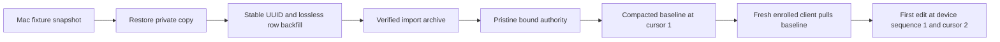

# Library snapshot and import preparation

`Scripts/synthetic_library_migration.py` prepares offline synthetic copies. It has
no live-library mode, network calls, credential handling, pairing, or application
activation hook. Each input library must have a regular `.capd-synthetic-fixture`
file containing exactly `synthetic-capd-library-v1` followed by a newline. Never add
this marker to a real Mac or phone library. All paths are explicit and canonical;
symlinks, special files, overlapping source/destination trees, and restore over an
existing destination are refused.

The existing Mac library is the primary import source. Phone captures are a separate
preservation and reconciliation requirement. An explicitly approved Mac snapshot has
a separate read-only acquisition path; it never uses the synthetic marker. Neither
path activates a real library, changes phone storage or deploys an authority.

## Approved Mac snapshot and copy-only dry run

`Scripts/mac_library_snapshot.py` supplies `capture_quiesced(source, destination)`.
The operator identifies the effective `CAPD_DIR` and all app, agent, CLI and share
writers, pauses them for acquisition, and restores their previous state afterwards.
The helper sends no process signals. It opens source files read-only and never opens
a source SQLite connection, creates SHM, checkpoints, migrates, changes permissions
or labels the source synthetic. It copies `capd.sqlite`, a present WAL/rollback journal
and the complete `assets` tree into a fresh private archive. Byte inventories before
and after copying must match; escaping symlinks and existing destinations are refused.
Favicons are a rebuildable cache and are outside this capture-content archive.

The immutable raw archive uses `capd-readonly-mac-snapshot-v1`. `restore_copy` performs
WAL recovery and SQLite backup on a separate working copy, preserving schema, rows,
FTS, SQLite headers and assets. Each working copy records its actual origin and own
canonical path under `capd-mac-import-copy-v1`; it cannot be confused with the live
source or a synthetic fixture. Backfill and initial import reuse the same checked
transformations as the synthetic path. The synthetic CLI retains its original guards.

`Scripts/mac_library_dry_run.py` restores twice for comparison, backfills only the
working copy, imports into an owned local authority, and compares the complete
authenticated HTTP baseline with every prepared record. It verifies unchanged capture
and FTS rows, preserved legacy sidecars, counts/identities, idempotence and empty device
history. Only aggregate counts and check results are printed. The loopback host and
its memory-only bearer/digest configuration are temporary; cleanup stops the host and
removes that configuration while retaining private archives and authority copies.

```sh
uv run --no-project python Scripts/mac_library_dry_run.py \
  --snapshot /explicit/private-run/snapshot \
  --run-root /explicit/private-run \
  --host-binary Packages/CapdSyncServer/.build/debug/capd-sync-server
```

These archive inventories detect corruption, not malicious archive forgery. Inputs
must be owned, approved local copies. The host's baseline and blob size limits still
apply. The dry run does not bind the live Mac Store, configure normal writers, import
phone content, provision real credentials or contact a NAS.

## Synthetic snapshot and restore

The caller stops every asset writer and keeps one writer per fixture root. A SQLite
`BEGIN IMMEDIATE` reserves the source writer while a separate reader uses SQLite's
online backup API, including committed WAL pages. The source database is never
checkpointed or copied as a bare file. The root owns one SQLite database, named
explicitly; all other files and directories are copied, including nested assets,
empty directories, favicons, partial uploads, and the exact asset ownership marker.
Do not place additional SQLite databases inside a library root.

The archive contains `payload/` and a completion manifest. The archive database uses
DELETE journal mode so verification does not create WAL sidecars inside the archive.
Table/schema/trigger/FTS state, SQLite autoincrement history, BLOB bytes, and persistent
header values (`user_version`, `application_id`, encoding, page size, auto-vacuum)
are verified. Journal mode is deliberately not an identity invariant: reopening a
restored Store establishes WAL again. Asset inventories are compared before and
after the snapshot. Verification checks every file and directory against the manifest;
these checks detect corruption, they do not authenticate an untrusted archive.

An identical repeated backup returns the existing verified archive. Changed source
state refuses that destination. A failed backup removes only its newly created
archive. Restore reserves a fresh destination, copies and verifies a private sibling
directory, then replaces the empty reservation atomically. Injected copy/verification
failures leave no restored library. An abrupt process kill can leave an incomplete
archive or reservation; the tool refuses incomplete backups and existing restore
targets. These checks do not establish power-loss durability or concurrent asset
writer support. Keep archives immutable while importing or restoring them.

```sh
uv run --no-project python Scripts/synthetic_library_migration.py backup "$FIXTURE" \
  --database capd.sqlite --destination "$ARCHIVE"
uv run --no-project python Scripts/synthetic_library_migration.py verify "$ARCHIVE"
uv run --no-project python Scripts/synthetic_library_migration.py restore "$ARCHIVE" \
  --destination "$FRESH_RESTORED_FIXTURE"
```

## Initial Mac import

`backfill` runs on the restored synthetic Mac copy. It leaves every `captures` row,
local integer ID, FTS source/index/trigger, schema migration record, and asset path
unchanged. Existing `sync_capture_ids` UUIDs are retained; unmapped rows receive one
UUID, transactionally. `sync_legacy_snapshot` holds the full SQL row, including fields
unknown to the shared model, typed BLOBs, original tag string/version, and a verified
image reference. Pinned tags map to manual tags and other legacy tags to generated
tags. Legacy storage cannot recover a manual/generated distinction it never stored.
Repeat is a no-op; changed/deleted source rows or changed assets refuse repeat.
Any missing image, invalid identity, or injected row failure rolls back the backfill.

`import-initial-mac` consumes a verified archive with that complete backfill. Its
destination is a synthetic, already initialized, pristine bound `SyncServer` root.
The database binding and `assets/library-owner` must both match the proposed
service/library UUIDs. The helper does not initialize the authority, issue grants,
change its binding, or enroll a client.

The standalone HTTP host uses `authority.sqlite` and `blobs/library-owner` beneath
its UUID-named library directory. For that layout, pass
`--authority-database authority.sqlite --authority-assets blobs`. The blob directory
must be an explicit single child name; the synthetic marker and ownership checks
still apply. Stop the owned host before offline import and reopen it afterwards.

The initial import is one SQL transaction. It copies verified nested images to their
content digests, stores lossless legacy payloads in `sync_imported_legacy`, and seeds
`sync_records` with stable capture UUIDs, exact seen counts, ratings, source values,
notes, dates, bodies, OCR, and separate manual/generated tags. The backfill is checked
against the archived source rows before any authority write. Duplicate content
fingerprints require reconciliation instead of silently merging imports.

The authority starts at a compacted baseline checkpoint: cursor and floor are 1,
capture revisions are 1, and feed, receipts, and device sequences remain empty.
`SyncServer.changes(after: 0)` therefore returns `cursorExpired`; existing clients
use the full baseline recovery path. A fresh enrolled client's first operation has
device sequence 1; its first changed feed entry is cursor 2. No fictitious operation,
receipt, feed author, or device counter is needed.

`sync_initial_import` records an explicit import UUID, archive fingerprint, and row
count. The same import and snapshot replay as a no-op, including after later genuine
server edits. A changed import UUID or snapshot is rejected. First import into an
authority with prior rows/history is rejected. SQL failure rolls back every imported
row/checkpoint/provenance entry and removes only newly created blob files; existing
verified blob files and ownership markers remain intact. A crash before SQL commit
can leave verified orphan blob files, which a retry can reuse without duplication.



```sh
uv run --no-project python Scripts/synthetic_library_migration.py backfill "$MAC_COPY" \
  --database capd.sqlite
uv run --no-project python Scripts/synthetic_library_migration.py backup "$MAC_COPY" \
  --database capd.sqlite --destination "$IMPORT_ARCHIVE"
uv run --no-project python Scripts/synthetic_library_migration.py import-initial-mac \
  "$IMPORT_ARCHIVE" --destination "$PRISTINE_BOUND_AUTHORITY_FIXTURE" \
  --authority-database server.sqlite --library-id "$LIBRARY_UUID" \
  --service-id "$SERVICE_UUID" --import-id "$IMPORT_UUID"
```

## Populated phone preparation and explicit enrollment protocol

`prepare-enrollment` snapshots a populated synthetic mobile library and returns an
enrollment proposal read from that verified snapshot. It retains local IDs, capture
UUIDs, device identity, every sequence/cursor/floor/observed counter, accepted records,
aliases, rejections, projection metadata, FTS, and the exact original pending BLOBs.
The proposal includes pending bytes as base64. The result is always `activation:
blocked`: it never inserts a binding, renumbers an operation, drains/reset the outbox,
reconstructs an operation payload, or seeds a server device counter.

The existing used-unbound database guard remains intact. A phone whose earliest
remaining operation is sequence 9 cannot safely send it to an empty server expecting
sequence 1. Its sequence claim alone is insufficient evidence for accepted work,
predecessor chains, rejected receipts, aliases, or observed revisions. The preparation
test demonstrates both the enrollment refusal and the server's sequence rejection.
`completeSequenceReplayCandidate` only identifies contiguous pending sequences from
1 through the allocated sequence; it is not enrollment permission or proof of valid
operations. Missing history, previously accepted state, and cursor compatibility
still require validation.

A concrete future offline migration coordinator needs to:

1. Freeze a copied phone snapshot and the Mac-seeded authority; validate service,
   library, source device, exact operation IDs/bytes, assets, and import provenance.
2. If the phone has a complete unsent history beginning at sequence 1 and no accepted
   history, replay those original operations through the actual `SyncServer.apply`
   path on a disposable authority copy. Retain the original outbox until real matching
   receipts are delivered; reconcile duplicate Mac/phone captures through existing
   canonical aliases. Validate the resulting projection before activation.
3. For an advanced sequence, require authoritative original receipts, device history,
   record revisions and aliases sufficient to verify every dependency. The current
   client alone cannot supply that proof. Combining this history with the Mac baseline
   requires a tested revision/history merge. If it is unavailable, retain the phone
   snapshot and outbox unchanged and keep enrollment blocked. The separate
   [content snapshot import](phone-content-snapshot-import.md) contract preserves
   visible content under honest new administrative receipts when original history
   is unavailable. It never acknowledges, resets or discards the original outbox
   and does not authorize a phone cutover.
4. Publish a bound migrated database and matching owned assets as a separately verified
   bundle through a future explicit migration initializer. That initializer must
   accept a validated authority migration result, not relax `SyncDatabase.prepare`.
   Switch app and share-extension storage together only after cutover approval.

## Remaining integration and live approvals

The usable first-import path is implemented and tested against actual `Store`,
`SyncServer`, and `SyncClient` types. Live migration is not ready. In particular:

- Typed shared metadata carries original update/last-seen times, reminders and source
  application through baseline/HTTP alongside the exact legacy sidecar. The opt-in
  Store path atomically enqueues capture/edit/enrichment/tag/delete mutations; see
  [Mac Store sync](mac-store-sync.md) for the complete mutation inventory and tests.
- An explicit verified initial-import handoff attaches a quiesced synthetic Mac copy
  to its matching baseline. Default app/CLI/agent adapters stay local-only; activating
  every writer needs a later approved cutover. All app, agent and CLI Store factories
  must load the same approved binding before the live database is bound: stale
  local-only writers are deliberately refused. The agent also needs the configured
  pull/push runtime so phone captures can reach its enrichment/tagging queues and the
  generated results can return through sync. Database import alone does not enable it.
  Attach the initial Mac copy while the authority is at cursor 1, before a content
  snapshot import advances the authority. Already bound clients then use full-baseline
  recovery; the strict initial-import handoff is not a general late-attachment API.
- Populated mobile enrollment and advanced-history merging remain blocked when
  original authority receipts, aliases and revision provenance are unavailable.
  The explicit synthetic content snapshot import preserves content separately,
  reports competing fields and lower-bound counts, and retains original history.
  No reset is an option for the current phone.
- Before any real-library access, approval must identify the Mac library root and
  authorize a read-only WAL-safe SQLite/assets snapshot while all Mac library/asset
  writers are quiesced. The next approved work is backfill and dry-run import of that
  copy into a separate local authority, followed by counts/IDs/metadata/FTS/image and
  restore comparison. It does not mutate the original Mac library or deploy to NAS.
- Phone inspection/export needs separate later approval and remains outside this
  phase. Live application storage switching, pairing/credentials, NAS deployment,
  and cutover each need their own approved scope after integration gaps are closed.
  This synthetic tool must not be made into a live tool by marking real storage.

## Focused tests

```sh
UV_CACHE_DIR=/tmp/capd-migration-uv-cache uv run --no-project python -m unittest \
  discover -s Scripts -p 'test_*library*.py' -v
swift test --filter MigrationPreparationTests
swift test --package-path Packages/CapdMobile --filter populatedMobileMigrationPreparation
```

The combined process test builds and starts the actual standalone host:

```sh
swift build --build-system native --package-path Packages/CapdSyncServer --product capd-sync-server
swift test --build-system native --filter MigrationHTTPIntegrationTests
```

It snapshots an actual synthetic Mac Store, restores/backfills a separate copy,
imports into the host's bound library layout, and pulls the compacted baseline and
verified image through `URLSessionSyncTransport`. The async `StoreSyncImportHandoff`
obtains and validates the authenticated metadata-capable baseline directly; there is
no test-only adapter for enrollment. Invalid credentials leave the copied Store
unbound. The attached Store enqueues an ordinary note update in its own transaction.
A response is discarded in the
test adapter after a real HTTP apply completes; reopening the client and restarting
the host retains the pending operation and retries identical request bytes. The
test checks one resulting feed change and preserved seen count for that retry,
idempotent import, duplicate-source aliasing with both note variants retained,
and live credential revocation. This loss injection is at the client response
boundary, not a simulated TCP interruption. The loopback transport policy is
test-only; production HTTPS policy and the application activation gate are unchanged.

Python fixtures cover committed WAL pages, FTS, autoincrement/header metadata,
nested/empty/partial assets and ownership markers, idempotence, rollback, corrupted
backup/restore refusal, unsafe paths, stale backfill rejection, and exact queued bytes.
The Swift Mac test uses the actual legacy schema, imports/replays, pulls a bound
baseline, downloads the image, edits at sequence 1/cursor 2, reopens the server, repeats
the import after that edit, and restores original Mac rows/FTS. The Swift mobile test
uses actual populated mobile state with accepted/generated content and advanced
pending sequences, then restores and compares device identity, pending raw bytes,
local projections and searches. No test reads a real library or physical device.
