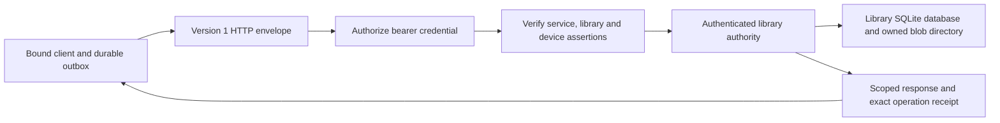

# Self-hosted sync preparation

Custom sync is the accepted engine direction. `CapdSync` now contains a versioned,
authenticated HTTP boundary and durable service/library enrollment checks. This is
preparation for a self-hosted service, such as DriehuisNAS. No service is deployed,
no real credentials are provisioned, and the Mac/iPhone default adapters remain
unconfigured. The existing reference socket remains a separate synthetic fixture.

## Prepared boundary

`SyncHTTPHandler` accepts `POST /v1/sync` with `Content-Type: application/json` and
an opaque bearer credential. Its injected `SyncAuthorizer` returns a server-owned
`SyncPrincipal`: service UUID, library UUID and enrolled device UUID. Token issuance,
expiry and revocation belong to that authorizer's host. The portable package has no
token database, network listener, TLS configuration or static production secrets.
The separate `CapdSyncServer` package supplies a loopback HTTP host and a digest-only
enrollment-file authorizer; see its [README](../../Packages/CapdSyncServer/README.md).

The version-1 JSON envelope carries an action and expected service/library/device
UUIDs. Those UUIDs assert the client's enrollment; they never select server storage.
The handler compares them to its configured service identity and authenticated
principal before looking up a library. An apply operation must also name that
principal's device UUID. The provider selects a `SyncServer` from the authenticated
library UUID, and the handler verifies its persisted service/library binding.

The five actions are apply, changes, baseline, upload and download. Fixture controls
and administrative actions are absent. Domain DTOs use their existing Codable
representation inside the separate versioned envelope; dates use JSONEncoder's
reference-date numeric representation and binary data uses base64. Version changes
need an explicit compatibility decision before clients are activated.

Cheap route, method and body-size checks precede authentication. Authentication
precedes JSON decoding, operation checks and storage access. Case-insensitive duplicate
credential headers are rejected. This boundary accepts the exact JSON media type;
a host must normalize any permitted media-type parameters deliberately. Request and
response JSON are bounded at 16 MiB, upload chunks at 64 KiB, feed pages at 1,000
changes, and blobs at the existing 8 MiB domain limit. Oversized full baselines fail
with a bounded resource-limit response; there is no streaming baseline implementation.
The HTTP host must enforce admission limits while reading the body, before buffering
it into the handler's `Data` value.

All replies are versioned JSON with `Cache-Control: no-store`. Success includes the
authenticated service/library/device scope. Authentication failures return 401,
identity mismatches 403, malformed/version failures 400, unsupported media type 415,
and oversized requests 413. Domain failures have stable error values: sequence/replay
or expired-cursor conflicts use 409, missing blobs 404, other invalid domain inputs
422, and connection failures 503. Unexpected storage/authorization errors become a
generic 503 response. Responses contain no raw errors, credentials or request echoes.

`SyncHTTPTransport` bridges a synchronous injected request executor to `SyncTransport`;
it is not a URLSession network adapter. It validates reply version, media type, size,
status and successful identity scope before returning a receipt. A lost response
leaves the original operation queued, and retry uses the existing idempotent receipt.

## Durable enrollment and storage

`SyncLibraryBinding` stores only a service UUID and library UUID, never a credential.
Enrollment is explicit through `SyncClient`'s optional binding argument. Binding is
recorded in the same database transaction that prepares its role/device identity.
Matching reopen succeeds; changing or omitting an existing binding fails. Bound
clients require a matching `BoundSyncTransport` and device UUID for push and pull;
unbound clients cannot silently use a production-bound transport. Client and server
transactions revalidate persisted binding, so a previously opened pristine unbound
handle fails closed after another handle enrolls the database. The server accepted
reader and blob entry points perform the same check.

First enrollment refuses a previously used unbound sync database, including nonzero
sequence/cursor/history, accepted or rejected work and aliases, even after its outbox
drains. Unbound blob bytes also block enrollment. This API does not migrate a populated
legacy Mac or mobile library. Application enrollment must choose fresh scoped storage
or implement and validate an explicit migration before enabling sync.

A server authority also persists the full service/library binding. Its blob directory
has an exclusively created ownership marker for that same binding, so two library
identities or services cannot silently share an asset root. Opening bound storage
without its binding fails. Rejected database enrollment occurs before a new blob
ownership marker is written. Initialization fails closed if the marker is corrupt or
its creation is interrupted. Database and blob-root enrollment are not one atomic
filesystem transaction; failed new enrollment may leave an empty bound database that
requires the same identity to reopen. The host owns one authority/BlobStore instance
per library and must not reuse existing unbound handles during enrollment.

## Integration still required

The intended host is self-hosted. Ezra identified DriehuisNAS as Intel macOS 15.8,
with 16 GB RAM and roughly 33 GB free storage; these are planning inputs, not capacity
or runtime verification. The standalone Intel executable is built on the local Mac,
targets macOS 15.0 and runs in the local Rosetta process checks. Its bundle includes
the required compiler compatibility libraries, so the NAS does not need a compiler
installation. Execution on the NAS's macOS 15.8 runtime remains unverified.

The host binds only `127.0.0.1`, requires explicit configuration and a fresh or matching
owned data root, and reloads digest-only device enrollment for each request. Revocation
is checked before authority lookup. Eight requests may collect a bounded body or wait
for the serial authority worker; SQLite and configuration work run outside NIO event
loops. SIGTERM/SIGINT shut down the host gracefully. Synthetic process checks cover
authentication, identity/header/body rejection, exact retries, assets, revocation and
persistence across restart. No NAS deployment or personal data is involved.

Deployment still needs an explicit owned storage location, process supervision,
HTTPS proxy configuration and a tested backup/restore policy covering SQLite state
and the complete asset directory, including ownership markers, together.

Application activation still needs pairing and secure credential issuance/rotation,
Keychain storage and an asynchronous HTTPS adapter. URLSession supplies
asynchronous networking; redirect handling must reject credential forwarding to a
new destination rather than relying on the default behavior. Host identity verification,
timeouts/cancellation, body limits and error-to-scheduler behavior need focused network
checks before activation. See Apple's [URLSession documentation](https://developer.apple.com/documentation/foundation/urlsession)
and [redirect callback](https://developer.apple.com/documentation/foundation/urlsessiontaskdelegate/urlsession(_:task:willperformhttpredirection:newrequest:completionhandler:)).

Total storage/history quotas, partial-upload cleanup, receipt/tombstone retention,
rate limits and streaming/paged baseline recovery remain host/design work.
Current in-process blob locking does not support multiple authority
processes staging the same root. The current tests establish synthetic protocol and
isolation behavior; they do not establish production performance, power-loss recovery
or background iOS delivery.

The Mac Store integration is also incomplete. Its fixture snapshot omits user-visible
`seenCount`, `lastSeenAt`, `reminderAt` and `sourceAppBundleID`; image conversion defaults
to no blob. Mixed generated/manual legacy tags use a union/pinned representation and
cannot preserve both categories losslessly. Ordinary Mac capture, annotation, delete
and enrichment paths do not atomically enqueue shared mutations. Local FTS and pipeline
bookkeeping can remain local, but user-visible metadata requires an explicit shared
schema/import decision. A live-library import and all ordinary mutation paths need
validation before production activation.

## Focused verification

Synthetic temporary databases and assets cover authentication/revocation before
storage lookup, service/library/device spoof rejection, provider mismatch, colliding
identities across isolated receipts/feed/baselines/blobs, accidental blob-root aliasing,
exact retry after a committed response is lost, bounded malformed requests/responses,
and immutable client enrollment with queued or previously acknowledged work. The
existing domain tests cover reconciliation and blob integrity. Mobile package tests
and a generic simulator compilation check default unconfigured API compatibility;
no live library, production account or deployed endpoint is used.
